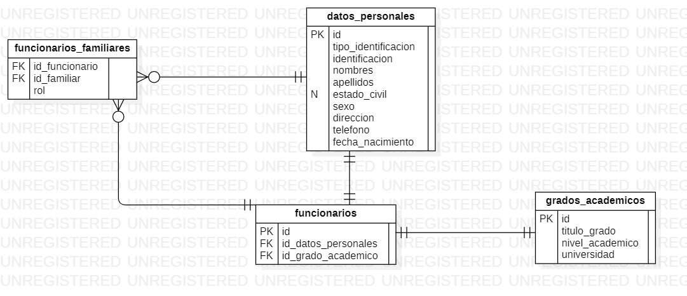

# EA1: Crud DAO y Manejo de excepciones en Java
Realizado por Andrés Felipe Acevedo para la materia Desarrollo de Software Seguro

## Modelo relacional:

- [script de creacion de la base de datos](https://github.com/felipevedo/iud-funcionarios/blob/main/creacion_bd.sql)
- [script de poblado de datos](https://github.com/felipevedo/iud-funcionarios/blob/main/inserciones.sql)
